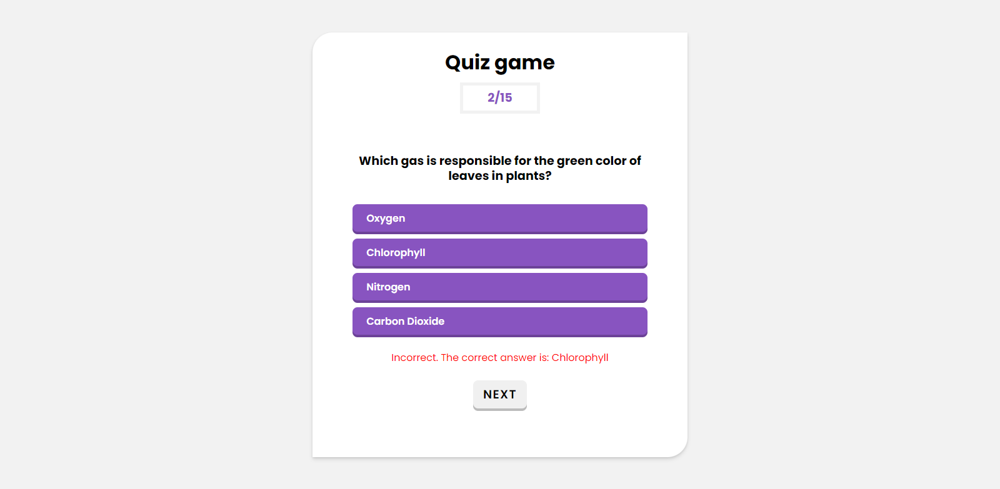
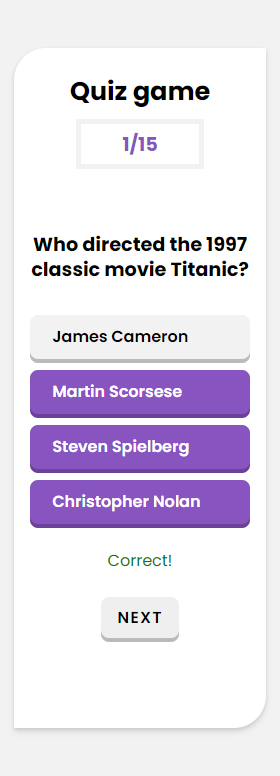

# Fun Trivia
This is a quiz game with easy general knowledge questions which users can use to test their knowledge.

## Overview

- ### Feedback
Users are able to see immediately they click on an option whether they are correct or incorrect. After the feedback, the **Next** button pops up to go to the next question.

- ### Progress
There is a progress bar at the top for users to see how many questions they've been able to answer as they progress.

- ### Result
After the last question has been answered, the user's score is displayed. Users are also presented with the option of playing again after the game ends.
*Questions and options are also shuffled randomly each time the game reloads.*

- ### Display
Users are able to view the optimal layout for the site depending on their device's screen size.

- ### Screenshots

- ### Link

## My process

### Built with

- Semantic HTML 5 markup
- CSS custom properties
- Vanilla javascript
- Flexbox
- CSS Grid
- Desktop-first workflow
